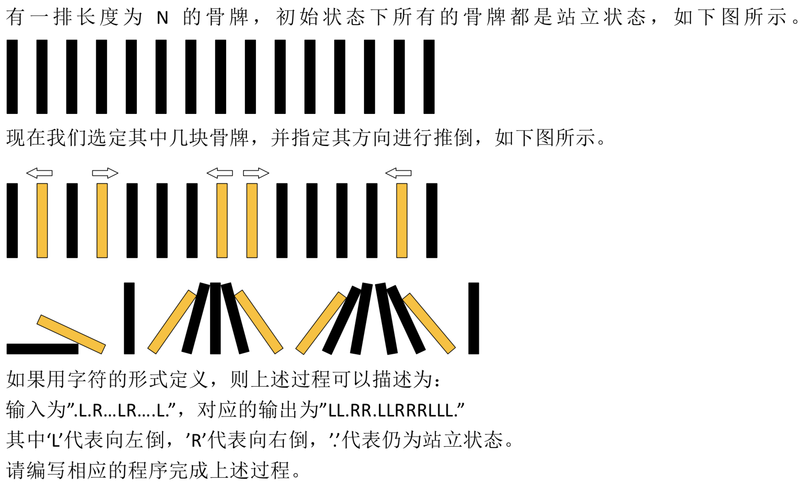

# 推倒吧骨牌

## :question:题目描述


>输入描述:
输入为一个长度不超过1000的，仅包含‘L’，‘R’，‘.’的字符串

>输出描述:
根据输入，输出一个仅由‘L’，‘R’，‘.’组成的结果字符串

>示例:
输入 
.L.R...LR....L.
输出
LL.RR.LLRRRLLL.

## :bulb:解决思路
使用状态机，分三种状态INIT，LEFT，RIGHT，初始状态为INIT，循环遍历字符串，遇到L或R字符进行相应的状态机转移和骨牌倾倒模拟操作，变量left，right表示向左向右倾倒时左边界值，倾倒时右边界值为i    
若当前字符s[i]为L
| 当前状态  |  转移状态   |   操作  |
|---------|---|---|
|INIT |	LEFT |	left至i的字符赋值为L，表示向左倾倒|
|LEFT |	LEFT(不变) |	同上|
|RIGHT |	INIT |	right至i的字符从两端开始左右各赋值R，L，表示两边向中间倾倒|
若当前字符s[j]为R
|当前状态 |	转移状态  |  操作 |
|-----|-----|------|
|INIT |	RIGHT |	right=i+1 |
|LEFT |	RIGHT(不变) |	同上|
|RIGHT|	RIGHT |	right至i的字符赋值为R，表示向右倾倒|
**注意：循环退出后，如果是XXXR....的情况，最后一部分向右倾倒的操作是没有完成的，需要补上
另外：对于RL中间插了一个R或L的情况，不才认为题意应该强调所有推倒是同时操作的**

## :pencil2:代码
```c++
#include <iostream>
using namespace std;
int main(void){
    enum {INIT, LEFT, RIGHT};
    string s;
    cin>>s;
    int boundary = s.length();
    int left = 0, right = 0, stage = INIT;
    for(int i = 0; i < boundary; ++i){
        if(s[i] == 'L'){
            switch (stage)
            {
            //注意这里为了节省代码量，INIT case没有break
            case INIT:
                stage = LEFT;
            case LEFT:
                for(int j = left; j < i; ++j)
                    s[j] = 'L';
                left = i+1;
                break;
            //(LEFT RIGHT)完成向中心倒的操作，此后状态回归到INIT
            case RIGHT:
                stage = INIT;
                for(int j = right, k = i-1; j < k; ++j, --k)
                    s[j] = 'R', s[k] = 'L';
                left = right = i+1;
            }
        }
        if(s[i] == 'R'){
            switch (stage)
            {
            case INIT:
            case LEFT:
                stage = RIGHT;
                right = i+1;
                break;
            case RIGHT:
                for(int j = right; j < i; ++j)
                    s[j] = 'R';
                right = i+1;
            }
        }
    }
    //注意最后退出循环时若状态为RIGHT，完成向右倒的操作
    if(stage == RIGHT)
        for(int j = right; j < boundary; ++j)
            s[j] = 'R';
    cout<<s<<endl;
    return 0;
}
```
[:arrow_left:上一题:漂流船问题](MinNumOfBoats.md)
[:arrow_right:下一题:重叠的装饰](#)